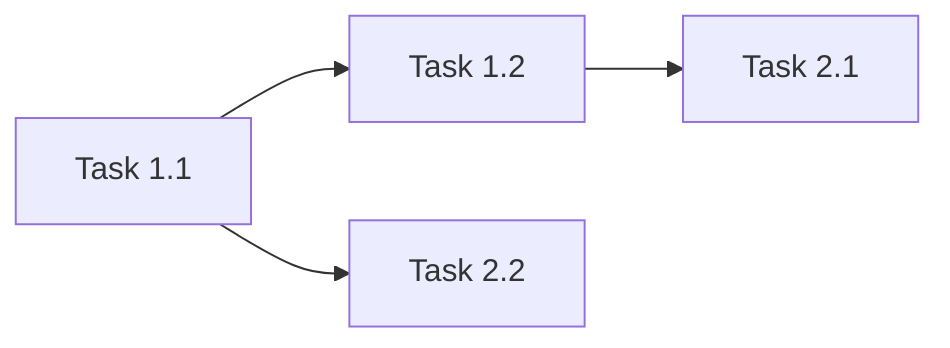

# {機能名} 実装計画書

## 1. 概要

### 1.1 関連ドキュメント
- ADR: [ADR-{NUMBER}: {TITLE}](../adr/{ADR_FILE})
- 設計書: [{機能名} システム設計書](../design/{DESIGN_FILE})

### 1.2 実装目標
{実装の目標を簡潔に記述}

### 1.3 前提条件
- {前提条件1}

## 2. 実装フェーズ

### Phase 1: {フェーズ名}

**目標**: {このフェーズの目標}
**推定規模**: {S/M/L}

#### Task 1.1: {タスク名}

**TDDステップ:**

1. **RED** - テスト作成
   - テストファイル: `src/test/java/{package}/{TestClass}.java`
   - テストケース:
     - [ ] {テストケース1の説明}
     - [ ] {テストケース2の説明}
   ```java
   // テストコードの概要
   @Test
   void should_{期待動作}_when_{条件}() {
       // Given: {前提条件}
       // When: {操作}
       // Then: {期待結果}
   }
   ```

2. **GREEN** - 最小実装
   - 実装ファイル: `src/main/java/{package}/{Class}.java`
   - 実装内容:
     - [ ] {実装項目1}
     - [ ] {実装項目2}

3. **REFACTOR** - リファクタリング
   - [ ] {リファクタリング項目}

**検証コマンド:**
```bash
./gradlew test --tests "{TestClass}"
# or
./mvnw test -Dtest="{TestClass}"
```

#### Task 1.2: {タスク名}
{同様のTDDステップ構造}

### Phase 2: {フェーズ名}
{同様のTask構造}

## 3. 銀行固有チェックポイント

各Phase完了時に確認:

### トランザクション
- [ ] `@Transactional` の境界が設計書通りか
- [ ] `propagation` 設定が適切か
- [ ] `rollbackFor` で適切な例外が指定されているか
- [ ] `readOnly = true` が読み取り専用操作に設定されているか

### 監査ログ
- [ ] すべての状態変更操作に監査ログが実装されているか
- [ ] PIIがログに含まれていないか
- [ ] 監査ログが独立したトランザクションで記録されているか

### 排他制御
- [ ] `@Version` フィールドが必要なエンティティに追加されているか
- [ ] `OptimisticLockException` のハンドリングが実装されているか
- [ ] デッドロック防止のためのロック順序が統一されているか

### 冪等性
- [ ] 冪等キーによる重複チェックが実装されているか
- [ ] リトライ安全な設計になっているか

### 金額計算
- [ ] `BigDecimal` が使用されているか（`double`/`float` 不使用）
- [ ] 丸めモード（`RoundingMode`）が明示的に指定されているか
- [ ] 通貨コードが考慮されているか

## 4. 依存関係



## 5. テスト戦略

### 5.1 テスト種別

| 種別 | 対象 | フレームワーク | カバレッジ目標 |
|------|------|-------------|-------------|
| Unit | Service, Domain | JUnit 5 + Mockito | 80%以上 |
| Integration | Repository, API | @SpringBootTest + TestContainers | 主要パス |
| E2E | ユーザーフロー | RestAssured / MockMvc | クリティカルパス |

### 5.2 テストデータ
- テストデータ方式: {Builder / Fixture / Factory}
- テストDB: {H2 / TestContainers}

## 6. 完了条件

- [ ] すべてのTaskが完了
- [ ] テストカバレッジ80%以上
- [ ] 銀行固有チェックポイントすべてクリア
- [ ] コードレビュー完了（`/bank-review`）
- [ ] CIパイプラインがグリーン
