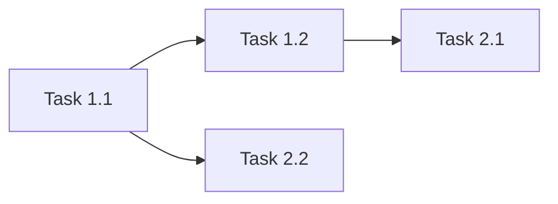

# {機能名} 実装計画書

## 1. 概要

### 1.1 関連ドキュメント
- ADR: [ADR-{NUMBER}: {TITLE}](./01-adr.md)
- 仕様書: [{機能名} 仕様書](./02-spec.md)

### 1.2 実装目標
{実装の目標を簡潔に記述}

### 1.3 前提条件
- {前提条件1}

## 2. 実装フェーズ

### Phase 1: {フェーズ名}

**目標**: {このフェーズの目標}
**推定規模**: {S/M/L}

#### Task 1.1: {タスク名}

**TDDステップ:**

1. **RED** - テスト作成
   - テストファイル: `{test_directory}/{TestFile}`
   - テストケース:
     - [ ] {テストケース1の説明}
     - [ ] {テストケース2の説明}
   ```pseudo
   // テストコードの概要
   // 期待動作を検証するテスト（条件）
   // Given: {前提条件}
   // When: {操作}
   // Then: {期待結果}
   ```

2. **GREEN** - 最小実装
   - 実装ファイル: `{source_directory}/{SourceFile}`
   - 実装内容:
     - [ ] {実装項目1}
     - [ ] {実装項目2}

3. **REFACTOR** - リファクタリング
   - [ ] {リファクタリング項目}

**検証コマンド:**
```bash
{test_command} {TestTarget}
```

#### Task 1.2: {タスク名}
{同様のTDDステップ構造}

### Phase 2: {フェーズ名}
{同様のTask構造}

## 3. ドメイン品質チェックポイント

各Phase完了時に確認:

### トランザクション
- [ ] トランザクション宣言の境界が設計書通りか
- [ ] トランザクション伝播モードの設定が適切か
- [ ] ロールバック条件で適切な例外が指定されているか
- [ ] 読み取り専用トランザクションが読み取り専用操作に設定されているか

### 監査ログ
- [ ] すべての状態変更操作に監査ログが実装されているか
- [ ] PIIがログに含まれていないか
- [ ] 監査ログが独立したトランザクションで記録されているか

### 排他制御
- [ ] バージョンフィールド（楽観ロック）が必要なエンティティに追加されているか
- [ ] 楽観ロック例外のハンドリングが実装されているか
- [ ] デッドロック防止のためのロック順序が統一されているか

### 冪等性
- [ ] 冪等キーによる重複チェックが実装されているか
- [ ] リトライ安全な設計になっているか

### 金額計算
- [ ] `高精度小数型` が使用されているか（`浮動小数点型` 不使用）
- [ ] 丸めモードが明示的に指定されているか
- [ ] 通貨コードが考慮されているか

## 4. 依存関係



## 5. テスト戦略

### 5.1 テスト種別

| 種別 | 対象 | フレームワーク | カバレッジ目標 |
|------|------|-------------|-------------|
| Unit | Service, Domain | テストフレームワーク | 80%以上 |
| Integration | Repository, API | 統合テストフレームワーク | 主要パス |
| E2E | ユーザーフロー | E2Eテストフレームワーク | クリティカルパス |

### 5.2 テストデータ
- テストデータ方式: {Builder / Fixture / Factory}
- テストDB: {テスト用データベース}

## 6. 完了条件

- [ ] すべてのTaskが完了
- [ ] テストカバレッジ80%以上
- [ ] ドメイン品質チェックポイントすべてクリア
- [ ] コードレビュー完了（`/review`）
- [ ] CIパイプラインがグリーン
