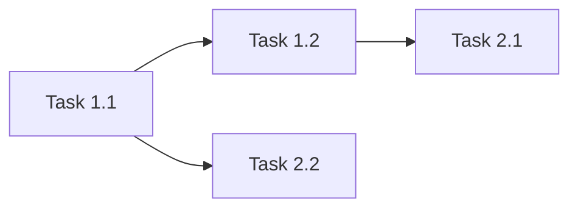

# {機能名} 実装計画書

## 1. 概要

### 1.1 関連ドキュメント
- ADR: [ADR-{NUMBER}: {TITLE}](./01-adr.md)
- 仕様書: [{機能名} 仕様書](./02-spec.md)

### 1.2 実装目標
{実装の目標を簡潔に記述}

### 1.3 前提条件
- {前提条件1}

## 2. 実装フェーズ

### Phase 1: {フェーズ名}

**目標**: {このフェーズの目標}
**推定規模**: {S/M/L}

#### Task 1.1: {タスク名}

**TDDステップ:**

1. **RED** - テスト作成
   - テストファイル: `{test_directory}/{TestFile}`
   - テストケース:
     - [ ] {テストケース1の説明}
     - [ ] {テストケース2の説明}
   ```pseudo
   // テストコードの概要
   // 期待動作を検証するテスト（条件）
   // Given: {前提条件}
   // When: {操作}
   // Then: {期待結果}
   ```

2. **GREEN** - 最小実装
   - 実装ファイル: `{source_directory}/{SourceFile}`
   - 実装内容:
     - [ ] {実装項目1}
     - [ ] {実装項目2}

3. **REFACTOR** - リファクタリング
   - [ ] {リファクタリング項目}

**検証コマンド:**
```bash
{test_command} {TestTarget}
```

#### Task 1.2: {タスク名}
{同様のTDDステップ構造}

### Phase 2: {フェーズ名}
{同様のTask構造}

## 3. 品質チェックポイント

各Phase完了時に確認:

### 基本チェック
- [ ] 仕様書との整合性が取れているか
- [ ] ADRの決定事項に準拠しているか
- [ ] テストカバレッジが目標を満たしているか
- [ ] コーディング規約に沿っているか

### プロジェクト固有チェック（references/ 配下のリファレンスに基づく）
{プロジェクトのドメインに応じたチェック項目を追加}

## 4. 依存関係


```mermaid
graph LR
    T1[Task 1.1] --> T2[Task 1.2]
    T2 --> T3[Task 2.1]
    T1 --> T4[Task 2.2]
```

## 5. テスト戦略

### 5.1 テスト種別

| 種別 | 対象 | フレームワーク | カバレッジ目標 |
|------|------|-------------|-------------|
| Unit | Service, Domain | テストフレームワーク | 80%以上 |
| Integration | Repository, API | 統合テストフレームワーク | 主要パス |
| E2E | ユーザーフロー | E2Eテストフレームワーク | クリティカルパス |

### 5.2 テストデータ
- テストデータ方式: {Builder / Fixture / Factory}
- テストDB: {テスト用データベース}

## 6. 完了条件

- [ ] すべてのTaskが完了
- [ ] テストカバレッジ80%以上
- [ ] 品質チェックポイントすべてクリア
- [ ] コードレビュー完了
- [ ] CIパイプラインがグリーン
