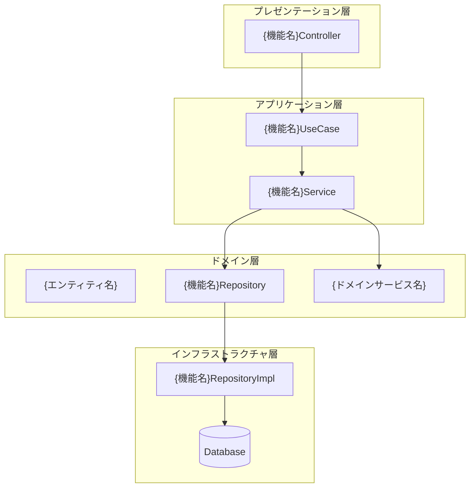
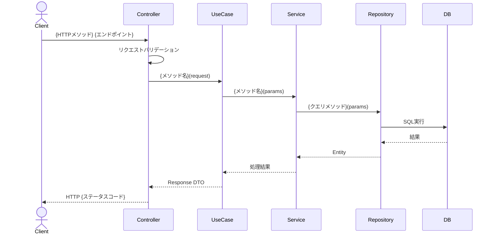
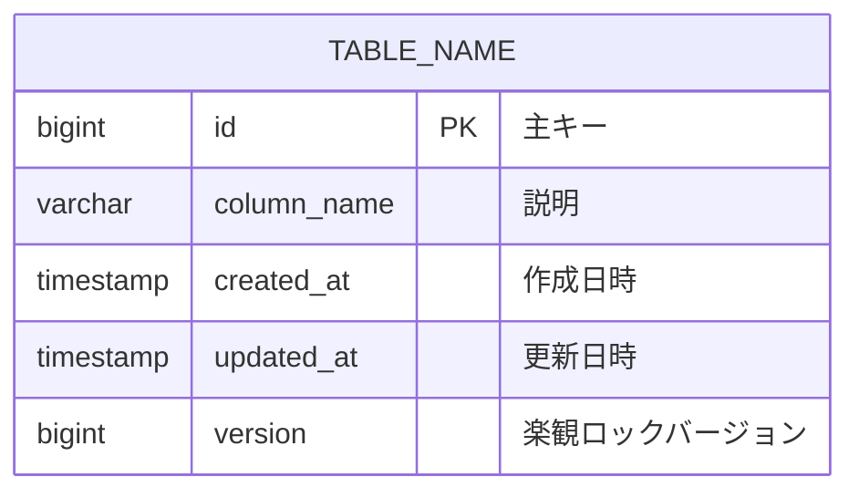

# {機能名} システム設計書

## 1. 概要

### 1.1 目的
{この機能の目的と背景}

### 1.2 関連ADR
- [ADR-{NUMBER}: {TITLE}](../adr/{ADR_FILE})

### 1.3 スコープ
- **対象**: {この設計書でカバーする範囲}
- **対象外**: {この設計書でカバーしない範囲}

## 2. コンポーネント設計

### 2.1 コンポーネント図



### 2.2 各コンポーネントの責務

| コンポーネント | 責務 | 備考 |
|------------|------|------|
| Controller | HTTPリクエストの受付・バリデーション・レスポンス変換 | |
| UseCase | ユースケースの実行制御 | |
| Service | ビジネスロジックの実行 | |
| Repository | データアクセスの抽象化 | |

## 3. シーケンス設計

### 3.1 正常系シーケンス



### 3.2 異常系シーケンス

{主要なエラーケースのシーケンス図}

## 4. API設計

### 4.1 エンドポイント一覧

| メソッド | パス | 説明 | 認証 |
|---------|------|------|------|
| {GET/POST/PUT/DELETE} | /api/v1/{resource} | {説明} | 要 |

### 4.2 リクエスト/レスポンス仕様

#### {エンドポイント名}

**リクエスト:**
```json
{
  "field": "type — 説明"
}
```

**レスポンス（成功）:**
```json
{
  "field": "type — 説明"
}
```

**レスポンス（エラー）:**
```json
{
  "error": {
    "code": "ERROR_CODE",
    "message": "エラーメッセージ"
  }
}
```

## 5. データモデル

### 5.1 ER図



### 5.2 テーブル定義

| カラム名 | 型 | NULL | デフォルト | 説明 |
|---------|------|------|----------|------|
| id | BIGINT | NO | AUTO | 主キー |
| version | BIGINT | NO | 0 | 楽観ロックバージョン |
| created_at | TIMESTAMP | NO | CURRENT_TIMESTAMP | 作成日時 |
| updated_at | TIMESTAMP | NO | CURRENT_TIMESTAMP | 更新日時 |

## 6. トランザクション設計

### 6.1 トランザクション境界

| 操作 | トランザクション範囲 | 伝播 | 読取専用 | 分離レベル |
|------|------------------|------|---------|----------|
| {操作名} | {Service/UseCase} | REQUIRED | {Yes/No} | {DEFAULT/READ_COMMITTED} |

### 6.2 ロールバック条件
- {ロールバックが発生する条件とrollbackFor設定}

### 6.3 排他制御
- **方式**: {バージョンフィールド（楽観ロック） / 悲観ロック(SELECT FOR UPDATE)}
- **対象**: {排他制御の対象エンティティ}
- **デッドロック防止**: {ロック順序等の対策}

## 7. 監査ログ設計

### 7.1 監査イベント

| イベント | トリガー | 記録データ | PII除外 |
|---------|---------|----------|---------|
| {イベント名} | {トリガー条件} | {記録する情報} | {除外するPIIフィールド} |

### 7.2 監査ログフォーマット
```json
{
  "timestamp": "ISO8601",
  "eventType": "{イベントタイプ}",
  "userId": "{操作者ID}",
  "action": "{操作内容}",
  "resourceType": "{リソース種別}",
  "resourceId": "{リソースID}",
  "details": {},
  "result": "SUCCESS/FAILURE",
  "ipAddress": "{IPアドレス}",
  "correlationId": "{相関ID}"
}
```

## 8. エラーハンドリング

### 8.1 エラー分類

| エラーコード | HTTPステータス | 説明 | リトライ可否 |
|------------|--------------|------|------------|
| {ERROR_CODE} | {4xx/5xx} | {説明} | {可/不可} |

### 8.2 冪等性設計
- **冪等キー**: {冪等キーの生成方法と格納場所}
- **重複検出**: {重複リクエストの検出方法}
- **有効期限**: {冪等キーの有効期限}

## 9. 非機能要件

### 9.1 パフォーマンス
- 目標レスポンスタイム: {ms}
- 目標スループット: {TPS}

### 9.2 セキュリティ
- 認証方式: {方式}
- 認可方式: {方式}
- データ暗号化: {方式}
