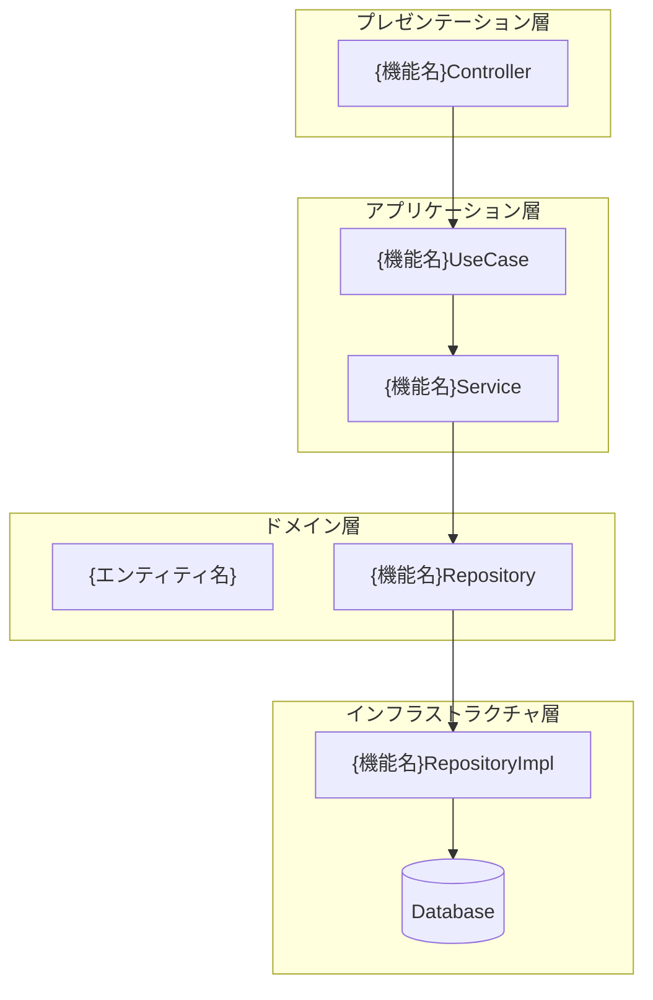
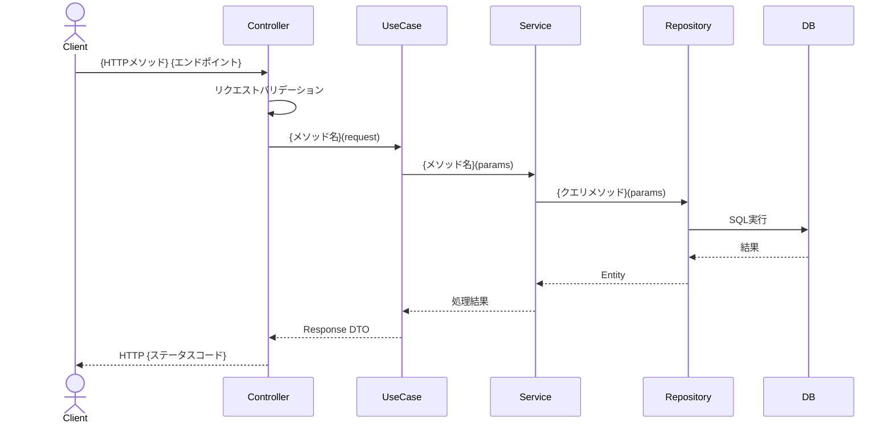
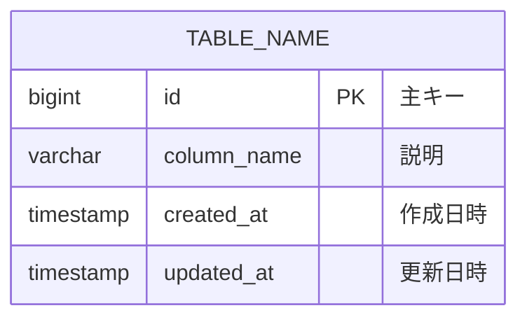

# {機能名} システム設計書

## 1. 概要

### 1.1 目的
{この機能の目的と背景}

### 1.2 関連ADR
- [ADR-{NUMBER}: {TITLE}](./01-adr.md)

### 1.3 スコープ
- **対象**: {この設計書でカバーする範囲}
- **対象外**: {この設計書でカバーしない範囲}

## 2. コンポーネント設計

### 2.1 コンポーネント図


```mermaid
graph TB
    subgraph Presentation["プレゼンテーション層"]
        Controller["{機能名}Controller"]
    end
    subgraph Application["アプリケーション層"]
        Service["{機能名}Service"]
        UseCase["{機能名}UseCase"]
    end
    subgraph Domain["ドメイン層"]
        Entity["{エンティティ名}"]
        Repository["{機能名}Repository"]
    end
    subgraph Infrastructure["インフラストラクチャ層"]
        RepositoryImpl["{機能名}RepositoryImpl"]
        DB[(Database)]
    end
    Controller --> UseCase
    UseCase --> Service
    Service --> Repository
    Repository --> RepositoryImpl
    RepositoryImpl --> DB
```

### 2.2 各コンポーネントの責務

| コンポーネント | 責務 | 備考 |
|------------|------|------|
| Controller | HTTPリクエストの受付・バリデーション・レスポンス変換 | |
| UseCase | ユースケースの実行制御 | |
| Service | ビジネスロジックの実行 | |
| Repository | データアクセスの抽象化 | |

## 3. シーケンス設計

### 3.1 正常系シーケンス


```mermaid
sequenceDiagram
    actor Client
    participant Controller
    participant UseCase
    participant Service
    participant Repository
    participant DB

    Client->>Controller: {HTTPメソッド} {エンドポイント}
    Controller->>Controller: リクエストバリデーション
    Controller->>UseCase: {メソッド名}(request)
    UseCase->>Service: {メソッド名}(params)
    Service->>Repository: {クエリメソッド}(params)
    Repository->>DB: SQL実行
    DB-->>Repository: 結果
    Repository-->>Service: Entity
    Service-->>UseCase: 処理結果
    UseCase-->>Controller: Response DTO
    Controller-->>Client: HTTP {ステータスコード}
```

### 3.2 異常系シーケンス

{主要なエラーケースのシーケンス図}

## 4. API設計

### 4.1 エンドポイント一覧

| メソッド | パス | 説明 | 認証 |
|---------|------|------|------|
| {GET/POST/PUT/DELETE} | /api/v1/{resource} | {説明} | 要 |

### 4.2 リクエスト/レスポンス仕様

#### {エンドポイント名}

**リクエスト:**
```json
{
  "field": "type — 説明"
}
```

**レスポンス（成功）:**
```json
{
  "field": "type — 説明"
}
```

**レスポンス（エラー）:**
```json
{
  "error": {
    "code": "ERROR_CODE",
    "message": "エラーメッセージ"
  }
}
```

## 5. データモデル

### 5.1 ER図


```mermaid
erDiagram
    TABLE_NAME {
        bigint id PK "主キー"
        varchar column_name "説明"
        timestamp created_at "作成日時"
        timestamp updated_at "更新日時"
    }
```

### 5.2 テーブル定義

| カラム名 | 型 | NULL | デフォルト | 説明 |
|---------|------|------|----------|------|
| id | BIGINT | NO | AUTO | 主キー |
| created_at | TIMESTAMP | NO | CURRENT_TIMESTAMP | 作成日時 |
| updated_at | TIMESTAMP | NO | CURRENT_TIMESTAMP | 更新日時 |

## 6. エラーハンドリング

### 6.1 エラー分類

| エラーコード | HTTPステータス | 説明 | リトライ可否 |
|------------|--------------|------|------------|
| {ERROR_CODE} | {4xx/5xx} | {説明} | {可/不可} |

## 7. 非機能要件

### 7.1 パフォーマンス
- 目標レスポンスタイム: {ms}
- 目標スループット: {TPS}

### 7.2 セキュリティ
- 認証方式: {方式}
- 認可方式: {方式}
- データ暗号化: {方式}

## 8. 追加設計（プロジェクトのドメインに応じて）

プロジェクトの要件に応じて、以下のような設計セクションを追加する。`references/` 配下のリファレンスを参照し、必要なセクションを選択する。

{例: トランザクション設計、排他制御設計、監査ログ設計、冪等性設計 等}
